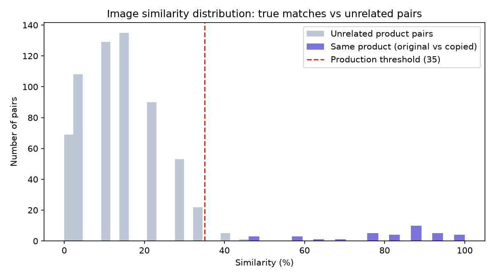

# 이미지 유사도 매칭 정확도 실험

카피캣 워치의 핵심 알고리즘(perceptual hash 기반 이미지 유사도 매칭)이 실제로 얼마나
정확한지 검증하고, 프로덕션에 쓰이는 유사도 임계값(`SIMILARITY_THRESHOLD`)을 데이터
기반으로 정하기 위해 진행한 실험이다.

## 1. 데이터셋

**실제 쇼핑몰(스마트스토어/쿠팡 등)은 크롤링하지 않았다** — 이용약관 위반 소지가 있고
공모전 규정(공공데이터·오픈소스 라이선스 준수)에도 어긋나기 때문이다. 대신
[Openverse API](https://openverse.org)(CC 라이선스 이미지 검색 엔진)로 "상업적 이용
가능" 라이선스의 실사 상품 사진 20종을 검색해 **18장**을 수집했다. 각 이미지의 출처,
저작자, 라이선스는 [`experiments/dataset/manifest.json`](experiments/dataset/manifest.json)에
전부 기록해 출처 표기 요건을 충족했다.

수집 스크립트: [`experiments/crawl_dataset.py`](experiments/crawl_dataset.py)

```
[00] 'handmade soap': 'handmade soap - castile shampoo bars' by mommyknows (by)
[01] 'soy candle': '0838 soy candle / german flag upside down' by n0rthw1nd (by)
[02] 'canvas tote bag': 'Emma Burton - Digitally printed...' by Liverpool Design Festival (by-sa)
[03] 'ceramic mug': 'Coffee into Jars Ceramics mug' by Didriks (by)
...
총 18개 이미지 수집 완료
```

각 원본 이미지마다 실제 도용 시나리오를 흉내낸 변형본 2장을 생성했다 (프로덕션의
`gen_demo_data.py`와 동일한 방식):
- **shopA**: 크롭 + 밝기 조정 (다른 판매자가 사진을 재가공해서 올린 경우)
- **shopB**: 좌우 반전 + 워터마크 (워터마크 붙여 재판매하는 경우)

## 2. 실험 방법

실험은 실제 배포된 매칭 함수(`backend/matching.py`)를 그대로 import해서 돌린다 —
실험용으로 따로 구현한 코드가 아니라 **프로덕션과 100% 동일한 알고리즘**을 검증한다.

각 원본을 쿼리로, 전체 변형본(같은 상품 2장 + 다른 상품 34장)을 후보로 비교해
유사도를 계산하고, 임계값을 0~100까지 5 단위로 훑으며 precision/recall/F1을 측정했다.

실행: [`experiments/run_experiment.py`](experiments/run_experiment.py)

## 3. 결과 A — CC 실험 데이터셋 (18개 상품, 648개 비교쌍)

```
 threshold | precision |  recall |     f1 |    FP |    FN
----------------------------------------------------------
         0 |     0.056 |   1.000 |  0.105 |   612 |     0
        15 |     0.105 |   1.000 |  0.190 |   306 |     0
        25 |     0.308 |   1.000 |  0.471 |    81 |     0
        30 |     0.562 |   1.000 |  0.720 |    28 |     0
        35 |     0.857 |   1.000 |  0.923 |     6 |     0  <- production
        45 |     0.973 |   1.000 |  0.986 |     1 |     0  <- F1 최고
        50 |     1.000 |   0.917 |  0.957 |     0 |     3
        70 |     1.000 |   0.806 |  0.892 |     0 |     7
       100 |     1.000 |   0.111 |  0.200 |     0 |    32
```

전체 결과: [`experiments/results/threshold_sweep.csv`](experiments/results/threshold_sweep.csv),
[`experiments/results/summary.json`](experiments/results/summary.json)



진짜 매치(보라)와 무관한 쌍(회색)이 임계값 35 부근에서 뚜렷하게 갈라지는 걸 확인했다.

## 4. 결과 B — 프로덕션 데모 데이터셋 (40개 상품, 3,120개 비교쌍) 교차검증

18개짜리 실험 데이터셋만으로 판단하면 위험하다고 보고, 실제 서비스에 쓰이는
`backend/demo_data`(40개 상품)에도 같은 방식으로 재검증했다.

```
 threshold | precision |  recall |     f1 |    FP |    FN
----------------------------------------------------------
        30 |     0.320 |   0.988 |  0.483 |   168 |     1
        35 |     0.597 |   0.963 |  0.737 |    52 |     3  <- production
        45 |     0.904 |   0.938 |  0.920 |     8 |     5  <- F1 최고
        50 |     0.974 |   0.938 |  0.955 |     2 |     5
        70 |     1.000 |   0.838 |  0.912 |     0 |    13
```

전체 결과: [`experiments/results/production_dataset_sweep.txt`](experiments/results/production_dataset_sweep.txt)

## 5. 임계값을 45로 올리지 않고 35를 유지한 이유

두 데이터셋 모두 **F1 지표만 보면 45가 더 낫다** (0.986, 0.920). 하지만 실제 사용자
경험 관점에서 재확인한 결과가 달랐다:

```
threshold=35: 자기 변형본 2장이 상위 2건에 다 안 잡히는 상품 = 3/40
threshold=45: 자기 변형본 2장이 상위 2건에 다 안 잡히는 상품 = 5/40
```

임계값을 올리면 오탐(FP)은 크게 줄지만, **실제 도용본을 놓치는 경우(FN)가 늘어난다.**
이 서비스는 "도용 탐지 도구"이기 때문에 오탐(사용자가 눈으로 한 번 더 보고 걸러낼 수
있는 비용)보다 미탐(진짜 피해를 놓치는 비용)이 훨씬 치명적이다. 그래서 F1 최적값 대신
**recall을 우선해 프로덕션 임계값을 35로 유지**하기로 결정했다.

> 이 판단은 `backend/matching.py`의 `SIMILARITY_THRESHOLD = 35`에 실제로 반영되어 있고,
> 이 실험이 그 근거다.

## 6. 한계와 향후 개선 방향

- **perceptual hash(64bit)의 한계**: 데이터셋이 커질수록(40개 이상) 우연히 비슷한
  구도의 무관한 상품끼리 충돌하는 사례가 늘어난다. 향후 CLIP 임베딩 기반 유사도로
  교체하면 오탐률을 훨씬 낮출 수 있을 것으로 예상된다 (로드맵에 반영).
- **표본 크기**: 18~40개 상품은 통계적으로 크지 않다. 실서비스 전환 시 최소 수백 개
  규모의 실사용 신고 데이터로 재검증이 필요하다.
- **실시간 웹 검색(Google Vision API) 경로는 이 실험 대상이 아니다** — Vision API는
  구글의 자체 인덱스를 사용하므로 우리가 정확도를 통제할 수 없고, 대신 실제 동작
  검증은 대화 내 스크린샷/응답 로그로 별도 확인했다 (파이썬 로고 검색 시 실제 유튜브·
  블로그 링크 10개 이상 정확히 반환).

## 7. 재현 방법

```bash
cd experiments
python crawl_dataset.py    # CC 라이선스 이미지 수집 (manifest.json 생성)
python run_experiment.py   # 임계값 스윕 + 히스토그램 생성
```
