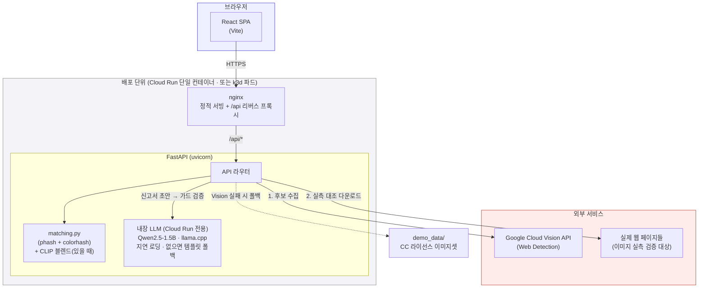

<div align="center">

# 카피캣 워치 (Copycat Watch)

**내 상품 사진이 어디서 무단 도용되고 있는지 AI가 실시간으로 찾아주고,<br/>
신고서 초안까지 자동으로 써주는 웹 서비스.**

<br/>

<!-- 언어 · 런타임 -->


<!-- 프레임워크 -->


<!-- 인프라 · AI -->

-326CE5?style=flat-square&logo=kubernetes&logoColor=white)


<br/>

[](https://copycat-watch-655097859028.asia-northeast3.run.app)

**상시 구동 데모 → https://copycat-watch-655097859028.asia-northeast3.run.app**

</div>

> 로컬 실행은 [빠르게 실행해보기](#빠르게-실행해보기), 클라우드 배포는 [`DEPLOY.md`](DEPLOY.md) 참고.

---

## 목차

- [문제 정의](#문제-정의)
- [핵심 기능](#핵심-기능)
- [작동 방식](#작동-방식)
- [아키텍처](#아키텍처)
- [기술 스택](#기술-스택)
- [디렉토리 구조](#디렉토리-구조)
- [빠르게 실행해보기](#빠르게-실행해보기)
- [API](#api)
- [정확도 검증 & 테스트](#정확도-검증--테스트)

---

## 문제 정의

온라인에서 상품을 파는 소상공인은 힘들게 찍은 상품 사진을 다른 판매자가 그대로(혹은
살짝 편집해서) 가져다 쓰는 일을 자주 겪는다. 하지만:

- 내 사진이 어디에 도용됐는지 직접 찾기가 어렵다 (검색엔진에 일일이 넣어봐야 함)
- 신고를 하려고 해도 플랫폼마다 절차가 다르고, 내용증명 같은 법적 문서는 형식을 모른다
- 피해 규모(손해액)를 스스로 산정하기 어렵다

**카피캣 워치는 사진 한 장으로 이 세 가지를 한 번에 해결한다.**

## 핵심 기능

| 기능 | 설명 |
|---|---|
| **실시간 웹 검색** | Google Cloud Vision API로 인터넷 전체에서 동일/유사 이미지가 게시된 페이지를 찾는다 |
| **다중 이미지 스캔** | 같은 상품을 여러 각도/배경으로 여러 장 올리면 각 후보를 모든 업로드 이미지와 대조해 최고 유사도를 취한다 (재현율↑, 최대 5장) |
| **서버 실측 검증** | Vision이 준 후보를 그대로 믿지 않고, 서버가 이미지를 직접 내려받아 자체 유사도 알고리즘으로 재검증한다 (오탐 제거) |
| **CLIP 의미적 유사도** | phash+colorhash가 놓치는 의미적 유사도(각도·배경·리터칭)를 CLIP(ViT-B/32) 임베딩으로 보강해 채택된 후보의 점수·정렬 품질을 높인다 (게이팅은 검증된 해시 기준 유지, 없으면 자동 폴백) |
| **딥 페이지 검증** | 이미지 다운로드가 막힌 사이트는 페이지 HTML을 직접 방문해 `og:image`/본문 이미지를 추출해 대조한다 |
| **중복 자동 제거** | 같은 글이 `http`/`https`, `www` 유무 등으로 여러 건 잡혀도 1건으로 병합한다 |
| **피해액 자동 계산** | 판매가 기반으로 예상 피해 규모를 산정한다 |
| **AI 신고서 3종** | 신고 사유서 · 내용증명 · 손해배상 청구내역서를 실제 한국 문서 관행(4단계 내용증명 구조, 저작권법 제125조 근거, 금액 한글 병기)에 맞춰 자동 작성 |
| **플랫폼 자동 감지** | 발견된 URL에서 쿠팡/네이버 스마트스토어/인스타그램 등 플랫폼을 자동 인식해 신고서 문구를 맞춘다 |
| **통합 신고서** | 여러 도용 사례를 체크박스로 선택해 하나로 묶은 통합 신고서 생성 |
| **AI 법적 대응 가이드** | 발견 건수·검증 여부·예상 피해액을 바탕으로 우선순위 대응 순서, 소액사건심판(소가 3,000만원 이하) 여부 판단, 무료 법률상담처(한국저작권위원회, 대한법률구조공단)를 안내 |
| **이미지 비교** | 내 원본과 발견된 이미지를 나란히 놓고 비교 |
| **증거 리포트 다운로드** | 원본 이미지·모든 매치·유사도·링크·피해액을 담은 인쇄 가능한 HTML 증거 문서를 즉시 생성 |
| **스캔 이력** | 세션 동안의 스캔 기록을 다시 불러와 확인 |

## 작동 방식

```
1. 상품명 + 상품 사진 업로드
        │
        ▼
2. AI 스캔 (2단계 파이프라인)
   ┌─────────────────────────────────────────────┐
   │ 1단계: Google Vision Web Detection            │
   │   → 인터넷 전체에서 후보 페이지/이미지 수집    │
   │                                                │
   │ 2단계: 서버 실측 검증                          │
   │   → 후보 이미지를 직접 다운로드                │
   │   → phash + colorhash로 원본과 재대조          │
   │   → 다운로드 차단 시 페이지 방문해 딥 검증      │
   │   → 중복 병합, 임계값 미만 제거                │
   └─────────────────────────────────────────────┘
        │
        ▼
3. 스캔 결과 (유사도·검증여부·피해액·바로가기 링크)
        │
        ├──▶ 4a. 매치 선택 → AI 신고서 (사유서/내용증명/손해배상) 생성
        ├──▶ 4b. AI 법적 대응 가이드 (대응 순서 · 소송 형태 판단 · 상담처 안내)
        └──▶ 4c. 증거 리포트 다운로드 (원본 포함 HTML 문서)
```

Google Vision API 키가 없거나 호출이 실패하면, 자동으로 **내장 데모 데이터셋**(CC
라이선스 실사 이미지 104종 × 변형본 2장)에서 phash+colorhash로 매칭하는 폴백 모드로
전환된다 — 데모 환경에서도 항상 동작을 보여줄 수 있다.

## 아키텍처



**단일 컨테이너** 토폴로지다 — nginx가 정적 서빙과 `/api` 리버스 프록시를 함께 처리해 프론트는
항상 same-origin으로 백엔드를 호출하고(CORS 없음), 같은 컨테이너의 uvicorn이 API를 담당한다.
신고서 생성용 LLM(약 1GB)은 **Cloud Run 이미지에만 내장**되며, 로컬 개발·k3d에서는 LLM 없이
템플릿 폴백으로 가볍게 돈다.

## 기술 스택

버전 근거: 백엔드 `requirements.txt` · 프론트 `package.json` · 컨테이너 base 이미지 태그.

**프론트엔드**


**백엔드**


**AI**


-EE4C2C?style=flat-square)


**인프라 · 테스트**


-326CE5?style=flat-square&logo=kubernetes&logoColor=white)


> **AI 아키텍처 원칙** — 법 조항·금액·기한 같은 **법적 사실은 전부 코드 템플릿이 소유**하고,
> LLM은 그 완성본을 자연스러운 한국어로 '다시 쓰기'만 한다. 모델 출력은 조항·금액·문서 구분자
> 보존 여부를 검증하는 가드([`backend/llm.py`](backend/llm.py))를 통과해야만 채택되며, 하나라도
> 어긋나면 원본 템플릿을 그대로 반환한다 → **환각이 최종 문서에 반영되지 않는다.**

## 디렉토리 구조

역할별로 4개 블록으로 나뉜다 — **① 애플리케이션**(backend/frontend), **② 배포**(Cloud Run 단일
컨테이너 · k8s), **③ 정확도 실험**, **④ 문서**.

```
copycat-watch/
│
├── backend/                     # ── 백엔드 (FastAPI) ──────────────────
│   ├── main.py                  #   API 엔드포인트 (/api/scan · report · legal-guide)
│   ├── matching.py              #   유사도 매칭 알고리즘 (phash + colorhash + CLIP 블렌드)
│   ├── clip_sim.py              #   CLIP(ViT-B/32, ONNX) 의미적 유사도 · 없으면 폴백
│   ├── llm.py                   #   로컬 LLM 신고서 다듬기 + 법적 사실 보존 가드
│   ├── gen_demo_data.py         #   데모 데이터셋 생성 스크립트
│   ├── demo_data/               #   상품 이미지 (원본 + 도용본 2장 세트)
│   ├── tests/                   #   pytest 43개 (matching · api · llm/clip 가드)
│   ├── requirements.txt         #   프로덕션 의존성
│   ├── requirements-llm.txt     #   로컬 LLM 의존성 (Cloud Run 이미지에서만 설치)
│   ├── requirements-clip.txt    #   CLIP(onnxruntime) 의존성 (Cloud Run 이미지에서만 설치)
│   ├── requirements-dev.txt     #   +pytest (개발용)
│   └── Dockerfile               #   백엔드 단독 이미지 (로컬/k8s용)
│
├── frontend/                    # ── 프론트엔드 (React SPA) ────────────
│   ├── src/
│   │   ├── App.jsx              #   전체 UI (상품등록 → 스캔결과 → 신고서)
│   │   └── App.css              #   디자인 시스템 (CSS 변수, 라이트/다크)
│   ├── drive.mjs                #   Playwright 시각 검증 스크립트
│   ├── vite.config.js           #   Vite 빌드 설정
│   └── Dockerfile               #   프론트 단독 이미지 (nginx, 로컬/k8s용)
│
├── Dockerfile                   # ── 배포 ①: Cloud Run 단일 컨테이너 ───
├── deploy/                      #   (프론트 빌드 + 백엔드 + nginx + LLM 내장)
│   ├── nginx.conf               #   정적 서빙 + /api 프록시(127.0.0.1:8000)
│   └── start.sh                 #   uvicorn(백그라운드) + nginx(포그라운드) 진입점
├── docker-compose.yml           #
├── k8s/                         # ── 배포 ②: Kubernetes(k3d) 매니페스트 ─
│   ├── backend.yaml             #   Deployment + Service (리소스 제한 포함)
│   ├── frontend.yaml            #   Deployment + Service
│   ├── ingress.yaml             #
│   └── secret.example.yaml      #   API 키 시크릿 템플릿
│
├── experiments/                 # ── 정확도 실험 (재현 가능) ───────────
│   ├── crawl_dataset.py         #   Openverse(CC 라이선스) 이미지 수집
│   ├── run_experiment.py        #   임계값 스윕 + 정확도 측정 + 차트 생성
│   ├── dataset/                 #   실험용 이미지 + manifest(출처/라이선스)
│   └── results/                 #   실험 결과 (CSV / JSON / PNG)
│
├── DEPLOY.md                    # ── 문서 ──────────────────────────────
├── EXPERIMENT.md                #   정확도 실험 전체 기록 (6 iteration)
└── README.md                    #   이 문서
```

> **배포 이미지가 2벌인 이유** — 루트 `Dockerfile`은 프론트+백엔드+LLM을 하나로 묶은 **Cloud Run
> 전용**(URL 1개, scale-to-zero)이고, `backend/Dockerfile`·`frontend/Dockerfile`은 **로컬 개발과
> k8s용**으로 서비스를 분리해 띄운다. 목적이 달라 공존한다.

## 빠르게 실행해보기

### 1. Docker Compose로 전체 스택 실행

```bash
git clone https://github.com/BcKmini/copycat-watch.git
cd copycat-watch
cp backend/.env.example backend/.env   # 필요시 API 키 입력 (없어도 데모 모드로 동작)
docker compose up --build
```

`http://localhost:8080` 접속.

### 2. Kubernetes(k3d)로 실행

```bash
k3d cluster create copycat --port "8080:80@loadbalancer"
docker compose build
k3d image import copycat-watch-backend:latest copycat-watch-frontend:latest -c copycat

kubectl create secret generic copycat-secrets --from-env-file=backend/.env
kubectl apply -f k8s/backend.yaml -f k8s/frontend.yaml -f k8s/ingress.yaml
```

### 3. Google Cloud Run으로 상시 구동 (프로덕션)

프론트 + 백엔드 + 내장 LLM을 **단일 컨테이너**로 묶어 URL 하나로 배포한다. 요청이 없으면
인스턴스가 0으로 축소(scale-to-zero)돼 비용이 거의 들지 않는다. **반드시 레포 루트에서** 실행한다.

```bash
gcloud run deploy copycat-watch --source . --region asia-northeast3 \
  --allow-unauthenticated --memory 2Gi --cpu 2 --cpu-boost \
  --set-secrets "GOOGLE_VISION_API_KEY=google-vision-api-key:latest"
```

전체 절차(시크릿 등록·IAM·비용)는 [`DEPLOY.md`](DEPLOY.md) 참고.
현재 배포본 → **https://copycat-watch-655097859028.asia-northeast3.run.app**

### 필요한 API 키 (없어도 데모 모드로 정상 동작)

| 키 | 용도 | 없을 때 동작 |
|---|---|---|
| `GOOGLE_VISION_API_KEY` | 실시간 웹 검색 | 내장 데모 데이터셋으로 폴백 |

> 신고서·법적 가이드 생성은 **이미지에 내장한 로컬 LLM**(Qwen2.5-1.5B)이 담당하므로 외부 AI
> API 키가 필요 없다. LLM이 없는 환경(로컬/k3d)에서는 고정 템플릿으로 폴백한다(문서 구조 동일).

`backend/.env`에 설정하면 된다 (`.env.example` 참고).

## API

| 엔드포인트 | 설명 |
|---|---|
| `POST /api/scan` | 이미지 업로드(`file`, 최대 5장) → 유사 이미지 스캔 (`mode: "web"` 또는 `"demo"`) |
| `GET /api/demo-image/{fname}` | 데모 매치 이미지 서빙 |
| `POST /api/report` | 매치 1건에 대한 신고서 3종 생성 (플랫폼 자동 감지) |
| `POST /api/report/batch` | 매치 여러 건을 묶은 통합 신고서 생성 |
| `POST /api/legal-guide` | 대응 순서·소송 형태 판단·무료 법률상담처를 안내하는 가이드 생성 |
| `GET /health` | 헬스체크 (k8s liveness/readiness probe) |

## 정확도 검증 & 테스트

- **`EXPERIMENT.md`**: CC 라이선스 실사 데이터셋으로 6단계에 걸쳐 진행한 정확도 실험
  전체 기록. phash 단독 → 색상 무시 버그 발견(pytest로) → colorhash 결합으로 F1
  0.737→0.962 개선 → 실시간 웹 검색 파이프라인 2단계 검증 → 표본 확대(91/104개) →
  현실적 도용 변형 5종(스크린샷·워터마크·재압축·썸네일·색보정)으로 재측정(41,405쌍,
  threshold=30에서 recall 0.976)까지의 과정과 수치를 전부 투명하게 공개.
- **`backend/tests/`**: pytest 43개 — 정상 케이스뿐 아니라 손상된 파일, 초과 용량,
  경로 탈출 시도, 완전히 다른 색의 단색 이미지, 다중 이미지 집계, CLIP 폴백 등
  히든 엣지케이스를 커버.
- **`frontend/drive.mjs`**: Playwright로 배포된 앱을 실제 헤드리스 브라우저에서
  클릭해가며 스크린샷으로 검증(라이트/다크모드, 신고서 작성, 뒤로가기 등).

```bash
cd backend && pytest tests/ -v          # 백엔드 테스트
cd experiments && python run_experiment.py   # 정확도 실험 재현
cd frontend && node drive.mjs           # 실제 화면 시각 검증
```
