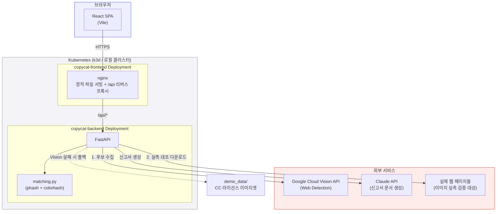

# 카피캣 워치 (Copycat Watch)

**내 상품 사진이 어디서 무단 도용되고 있는지 AI가 실시간으로 찾아주고, 신고서 초안까지
자동으로 써주는 웹 서비스.**


> 실행 방법은 [빠르게 실행해보기](#빠르게-실행해보기) 참고

---

## 목차

- [문제 정의](#문제-정의)
- [핵심 기능](#핵심-기능)
- [작동 방식](#작동-방식)
- [아키텍처](#아키텍처)
- [기술 스택](#기술-스택)
- [디렉토리 구조](#디렉토리-구조)
- [빠르게 실행해보기](#빠르게-실행해보기)
- [API](#api)
- [정확도 검증 & 테스트](#정확도-검증--테스트)
- [향후 로드맵](#향후-로드맵)

---

## 문제 정의

온라인에서 상품을 파는 소상공인은 힘들게 찍은 상품 사진을 다른 판매자가 그대로(혹은
살짝 편집해서) 가져다 쓰는 일을 자주 겪는다. 하지만:

- 내 사진이 어디에 도용됐는지 직접 찾기가 어렵다 (검색엔진에 일일이 넣어봐야 함)
- 신고를 하려고 해도 플랫폼마다 절차가 다르고, 내용증명 같은 법적 문서는 형식을 모른다
- 피해 규모(손해액)를 스스로 산정하기 어렵다

**카피캣 워치는 사진 한 장으로 이 세 가지를 한 번에 해결한다.**

## 핵심 기능

| 기능 | 설명 |
|---|---|
| **실시간 웹 검색** | Google Cloud Vision API로 인터넷 전체에서 동일/유사 이미지가 게시된 페이지를 찾는다 |
| **서버 실측 검증** | Vision이 준 후보를 그대로 믿지 않고, 서버가 이미지를 직접 내려받아 자체 유사도 알고리즘으로 재검증한다 (오탐 제거) |
| **딥 페이지 검증** | 이미지 다운로드가 막힌 사이트는 페이지 HTML을 직접 방문해 `og:image`/본문 이미지를 추출해 대조한다 |
| **중복 자동 제거** | 같은 글이 `http`/`https`, `www` 유무 등으로 여러 건 잡혀도 1건으로 병합한다 |
| **피해액 자동 계산** | 판매가 기반으로 예상 피해 규모를 산정한다 |
| **AI 신고서 3종** | 신고 사유서 · 내용증명 · 손해배상 청구내역서를 실제 한국 문서 관행(4단계 내용증명 구조, 저작권법 제125조 근거, 금액 한글 병기)에 맞춰 자동 작성 |
| **플랫폼 자동 감지** | 발견된 URL에서 쿠팡/네이버 스마트스토어/인스타그램 등 플랫폼을 자동 인식해 신고서 문구를 맞춘다 |
| **통합 신고서** | 여러 도용 사례를 체크박스로 선택해 하나로 묶은 통합 신고서 생성 |
| **AI 법적 대응 가이드** | 발견 건수·검증 여부·예상 피해액을 바탕으로 우선순위 대응 순서, 소액사건심판(소가 3,000만원 이하) 여부 판단, 무료 법률상담처(한국저작권위원회, 대한법률구조공단)를 안내 |
| **이미지 비교** | 내 원본과 발견된 이미지를 나란히 놓고 비교 |
| **증거 리포트 다운로드** | 원본 이미지·모든 매치·유사도·링크·피해액을 담은 인쇄 가능한 HTML 증거 문서를 즉시 생성 |
| **스캔 이력** | 세션 동안의 스캔 기록을 다시 불러와 확인 |

## 작동 방식

```
1. 상품명 + 상품 사진 업로드
        │
        ▼
2. AI 스캔 (2단계 파이프라인)
   ┌─────────────────────────────────────────────┐
   │ 1단계: Google Vision Web Detection            │
   │   → 인터넷 전체에서 후보 페이지/이미지 수집    │
   │                                                │
   │ 2단계: 서버 실측 검증                          │
   │   → 후보 이미지를 직접 다운로드                │
   │   → phash + colorhash로 원본과 재대조          │
   │   → 다운로드 차단 시 페이지 방문해 딥 검증      │
   │   → 중복 병합, 임계값 미만 제거                │
   └─────────────────────────────────────────────┘
        │
        ▼
3. 스캔 결과 (유사도·검증여부·피해액·바로가기 링크)
        │
        ├──▶ 4a. 매치 선택 → AI 신고서 (사유서/내용증명/손해배상) 생성
        ├──▶ 4b. AI 법적 대응 가이드 (대응 순서 · 소송 형태 판단 · 상담처 안내)
        └──▶ 4c. 증거 리포트 다운로드 (원본 포함 HTML 문서)
```

Google Vision API 키가 없거나 호출이 실패하면, 자동으로 **내장 데모 데이터셋**(CC
라이선스 실사 이미지 104종 × 변형본 2장)에서 phash+colorhash로 매칭하는 폴백 모드로
전환된다 — 데모 환경에서도 항상 동작을 보여줄 수 있다.

## 아키텍처



Ingress 없이 nginx가 정적 파일 서빙과 `/api` 리버스 프록시를 동시에 처리하므로,
프론트엔드는 항상 same-origin으로 백엔드를 호출한다 (CORS 걱정 없음).

## 기술 스택

| 영역 | 사용 기술 |
|---|---|
| 프론트엔드 | React 19, Vite 8, 순수 CSS(변수 기반 다크모드) |
| 백엔드 | FastAPI, Pillow, imagehash(phash/colorhash), requests |
| AI | Google Cloud Vision API(Web Detection), Anthropic Claude API(Haiku) |
| 인프라 | Docker, Kubernetes(k3d), nginx |
| 테스트 | pytest(백엔드 30개), Playwright(프론트 시각 검증) |
| 실험 | matplotlib(정확도 차트), Openverse API(CC 라이선스 데이터 수집) |

## 디렉토리 구조

```
copycat-watch/
├── backend/                     # FastAPI 서버
│   ├── main.py                  #   API 엔드포인트 (/api/scan, /api/report, ...)
│   ├── matching.py              #   유사도 매칭 알고리즘 (phash + colorhash)
│   ├── gen_demo_data.py         #   데모 데이터셋 생성 스크립트
│   ├── demo_data/               #   104개 상품 × 3장(원본+도용본 2장) CC 라이선스 이미지
│   ├── tests/                   #   pytest 30개 (매칭 로직 + API 엔드포인트)
│   ├── requirements.txt         #   프로덕션 의존성
│   ├── requirements-dev.txt     #   +pytest (개발용)
│   └── Dockerfile
│
├── frontend/                    # React SPA
│   ├── src/
│   │   ├── App.jsx              #   전체 UI (3단계: 상품등록 → 스캔결과 → 신고서)
│   │   └── App.css              #   디자인 시스템 (CSS 변수, 라이트/다크)
│   ├── drive.mjs                #   Playwright 시각 검증 스크립트
│   ├── nginx.conf.template      #   정적 서빙 + /api 프록시 설정
│   └── Dockerfile
│
├── k8s/                         # Kubernetes 매니페스트
│   ├── backend.yaml             #   Deployment + Service (리소스 제한 포함)
│   ├── frontend.yaml            #   Deployment + Service
│   ├── ingress.yaml
│   └── secret.example.yaml      #   API 키 시크릿 템플릿
│
├── experiments/                 # 정확도 실험 (재현 가능)
│   ├── crawl_dataset.py         #   Openverse(CC 라이선스) 이미지 수집
│   ├── run_experiment.py        #   임계값 스윕 + 정확도 측정 + 차트 생성
│   ├── dataset/                 #   수집된 실험용 이미지 + manifest(출처/라이선스)
│   └── results/                 #   실험 결과(CSV/JSON/PNG)
│
├── docker-compose.yml           # 로컬 통합 실행
├── EXPERIMENT.md                # 정확도 실험 전체 기록 (5 iteration)
└── README.md                    # 이 문서
```

## 빠르게 실행해보기

### 1. Docker Compose로 전체 스택 실행

```bash
git clone https://github.com/BcKmini/copycat-watch.git
cd copycat-watch
cp backend/.env.example backend/.env   # 필요시 API 키 입력 (없어도 데모 모드로 동작)
docker compose up --build
```

`http://localhost:8080` 접속.

### 2. Kubernetes(k3d)로 실행

```bash
k3d cluster create copycat --port "8080:80@loadbalancer"
docker compose build
k3d image import copycat-watch-backend:latest copycat-watch-frontend:latest -c copycat

kubectl create secret generic copycat-secrets --from-env-file=backend/.env
kubectl apply -f k8s/backend.yaml -f k8s/frontend.yaml -f k8s/ingress.yaml
```

### 필요한 API 키 (둘 다 없어도 데모 모드로 정상 동작)

| 키 | 용도 | 없을 때 동작 |
|---|---|---|
| `GOOGLE_VISION_API_KEY` | 실시간 웹 검색 | 내장 데모 데이터셋으로 폴백 |
| `ANTHROPIC_API_KEY` | AI 신고서 생성 | 고정 템플릿으로 폴백 (문서 구조는 동일) |

`backend/.env`에 설정하면 된다 (`.env.example` 참고).

## API

| 엔드포인트 | 설명 |
|---|---|
| `POST /api/scan` | 이미지 업로드 → 유사 이미지 스캔 (`mode: "web"` 또는 `"demo"`) |
| `GET /api/demo-image/{fname}` | 데모 매치 이미지 서빙 |
| `POST /api/report` | 매치 1건에 대한 신고서 3종 생성 (플랫폼 자동 감지) |
| `POST /api/report/batch` | 매치 여러 건을 묶은 통합 신고서 생성 |
| `POST /api/legal-guide` | 대응 순서·소송 형태 판단·무료 법률상담처를 안내하는 가이드 생성 |
| `GET /health` | 헬스체크 (k8s liveness/readiness probe) |

## 정확도 검증 & 테스트

- **`EXPERIMENT.md`**: CC 라이선스 실사 데이터셋으로 4단계에 걸쳐 진행한 정확도 실험
  전체 기록. phash 단독 → 색상 무시 버그 발견(pytest로) → colorhash 결합으로 F1
  0.737→0.962 개선 → 실시간 웹 검색 파이프라인 2단계 검증까지의 과정과 수치를 전부
  투명하게 공개.
- **`backend/tests/`**: pytest 30개 — 정상 케이스뿐 아니라 손상된 파일, 초과 용량,
  경로 탈출 시도, 완전히 다른 색의 단색 이미지 등 히든 엣지케이스를 커버.
- **`frontend/drive.mjs`**: Playwright로 배포된 앱을 실제 헤드리스 브라우저에서
  클릭해가며 스크린샷으로 검증(라이트/다크모드, 신고서 작성, 뒤로가기 등).

```bash
cd backend && pytest tests/ -v          # 백엔드 테스트
cd experiments && python run_experiment.py   # 정확도 실험 재현
cd frontend && node drive.mjs           # 실제 화면 시각 검증
```

## 향후 로드맵

- CLIP 임베딩 기반 유사도로 교체 (구조·색상·질감을 함께 학습된 표현으로 비교)
- 정기 자동 모니터링 + 이메일 알림
- 다중 이미지 업로드로 스캔 정확도 향상
- 플랫폼 신고 API 직접 연동 (수동 제출 없이 원클릭 신고)
- 변호사·법무법인 매칭 연동 (법적 대응 가이드에서 바로 상담 신청)
